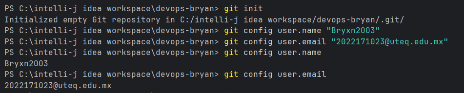
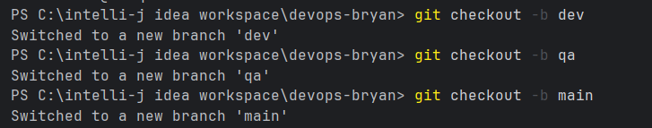
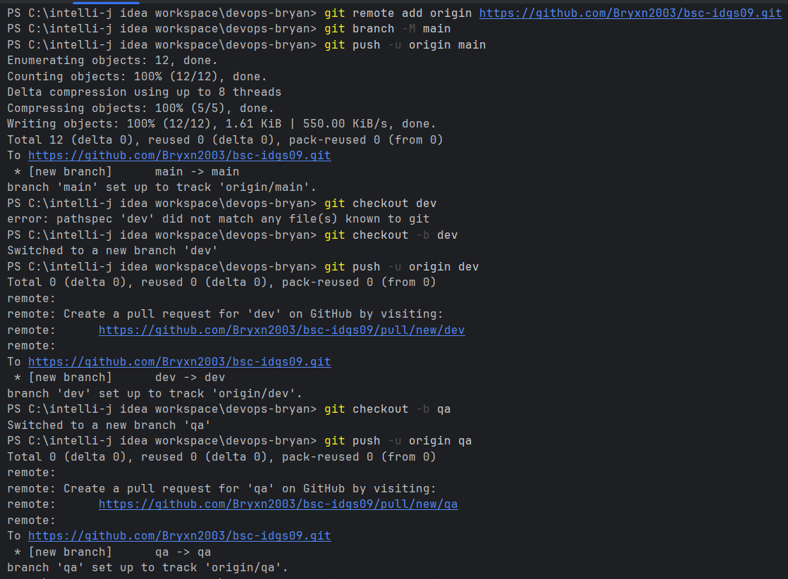

# Proyecto Azure DevOps - Bryan Sánchez Cabrera

## Información del Estudiante
- *Nombre:* Bryan Sánchez Cabrera
- *Grupo:* IDGS09

## Descripción del Proyecto
Este repositorio contiene la actividad práctica de Azure DevOps:

- Creación de repositorio con nomenclatura de iniciales y grupo
- Implementación de ramas dev y qa

## Estructura de Ramas

- main (producción)
- ├── qa (testing)
- └── dev (desarrollo)

## Capturas de Pantalla

### 1. Configuración del Repositorio

### 2. Creación de Ramas

### 3. Commits y repositorio remoto}

